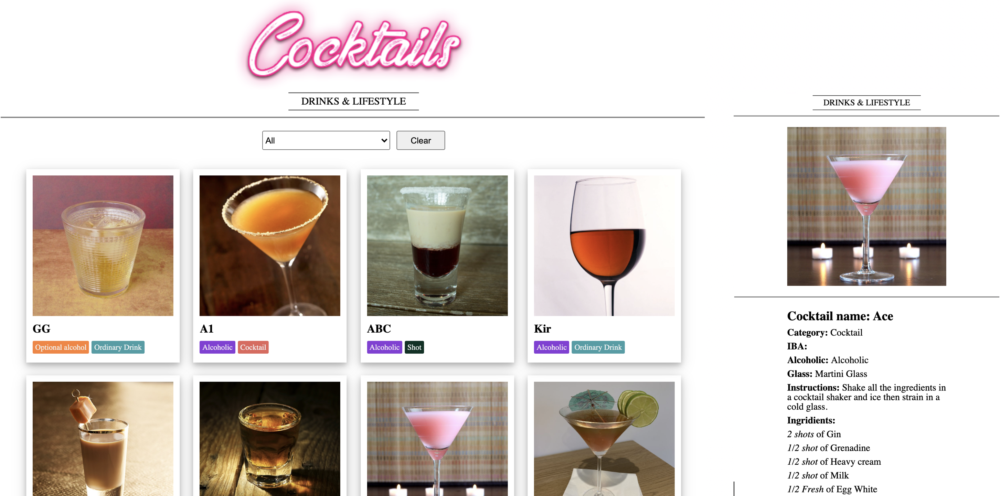

# REACT & REDUX COCKTAILS APP

> A cocktails application built using React, Redux and [CocktailsDB](https://www.thecocktaildb.com/api.php);

## Watch the Live Version

[Live Demo](https://azamats-cocktails.herokuapp.com/)



### Built with
- JavaScript ES6
- React
- React-Redux
- react-dom
- react-router-dom
- Axios
- NodeJS
- Webpack
- Buildpack
- Heroku
- Jest

### Features
- Viewing list of cocktails;
- Filtering cocktails by name;
- Get detailed information by clicking on cocktail OR providing idDrink in url as a param;

### Future features
- Increase records of cocktails
- Filtering based on category, ingridient, alcoholic;
- Adding new cocktail;

## Getting Started

In order to run locally this project type the following commands over the terminal in Linux or Mac or the Windows cmd console:

```s
$ git clone git@github.com:bettercallazamat/react-cocktails.git
$ cd react-cocktails
$ npm install
$ npm start

```

Open `http://localhost:3000` to view running project in the browser.

## Author

👤 **Azamat Nuriddinov**

- Github: [@bettercallazamat](https://github.com/bettercallazamat)
- Twitter: [@azamat_nuriddin](https://twitter.com/azamat_nuriddin)
- Linkedin: [Azamat Nuriddinov](https://www.linkedin.com/in/azamat-nuriddinov/)

## Acknowledgements
Thanks to <strong>The CocktailDB team</strong> for [API](https://www.thecocktaildb.com/api.php)

## 🤝 Contributing

Contributions, issues, and feature requests are welcome!

Feel free to check the [issues page](https://github.com/bettercallazamat/react-cocktails/issues).

## Show your support

Give a ⭐️ if you like this project!

## 📝 License

This project is [MIT](LICENSE) licensed.